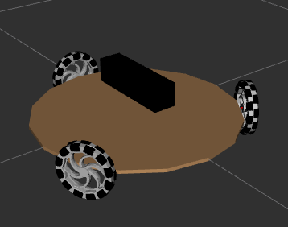
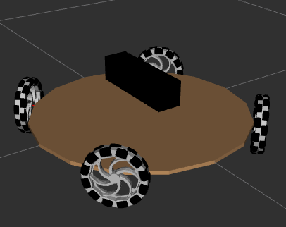

# jolie_description
This repo contains robot's descriptions for krai2025.

## Viewing the robot description
```
ros2 launch jolie_description display.launch.py
```
| Parameter | Description |
|-|-|
| `xacro_file` | (default: nebula_3wd.urdf.xacro) <br/> Path to the .urdf.xacro file relative to urdf folder.|

## Available models
| Robot Model | Description |
|-|-|
| `nebula_3wd.urdf.xacro` |  |
| `nebula_4wd.urdf.xacro` |  |

